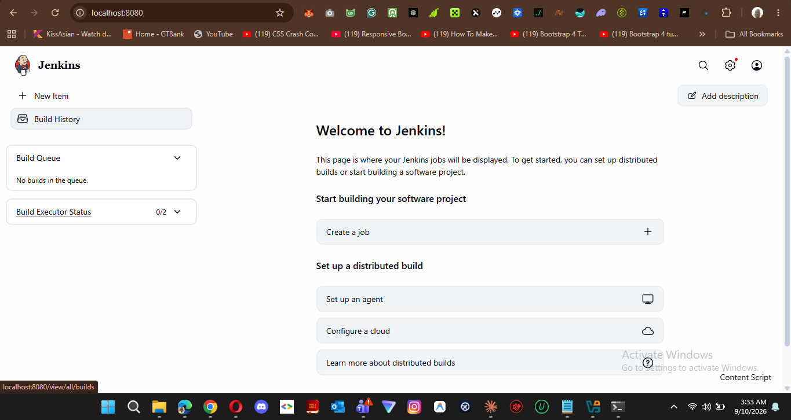
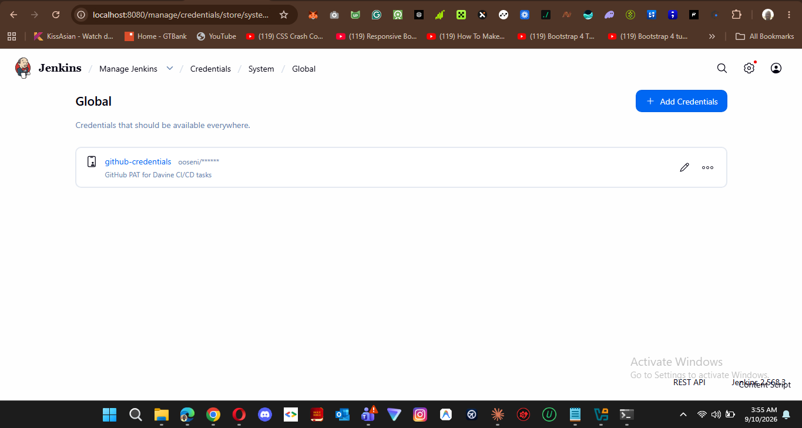
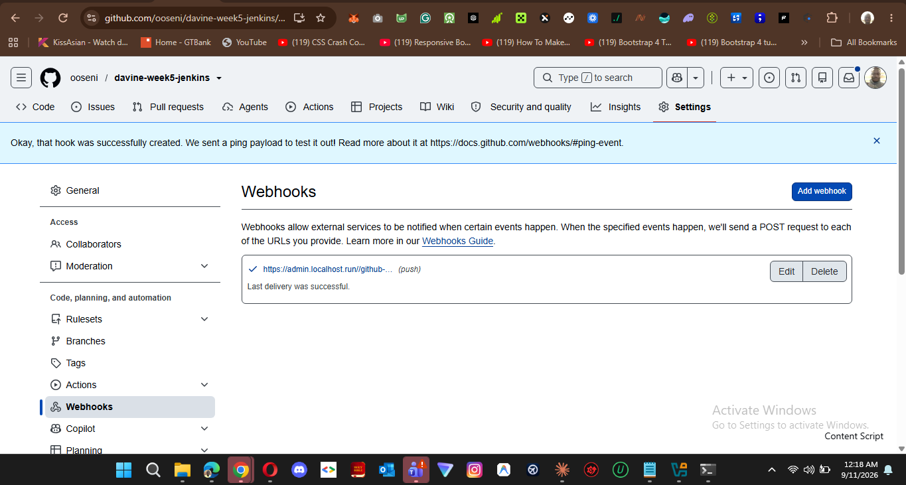
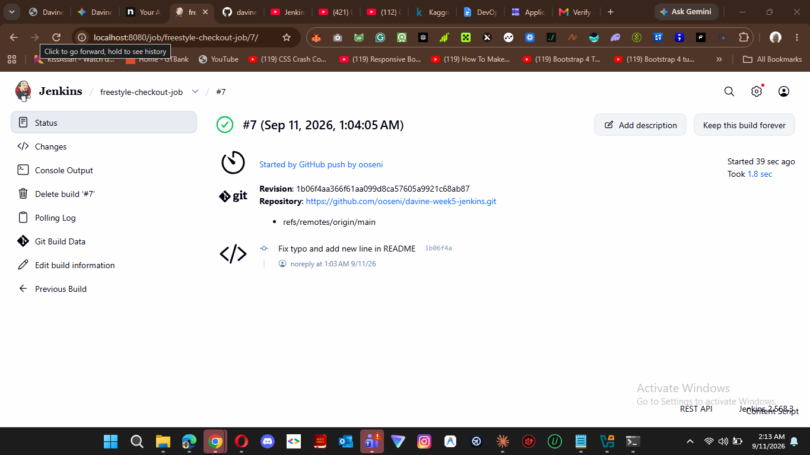
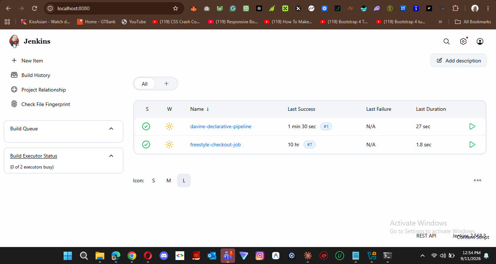
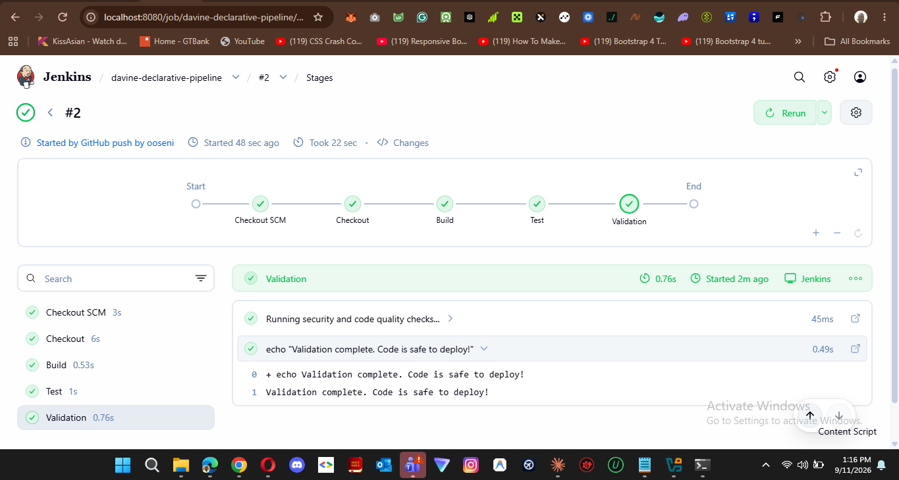
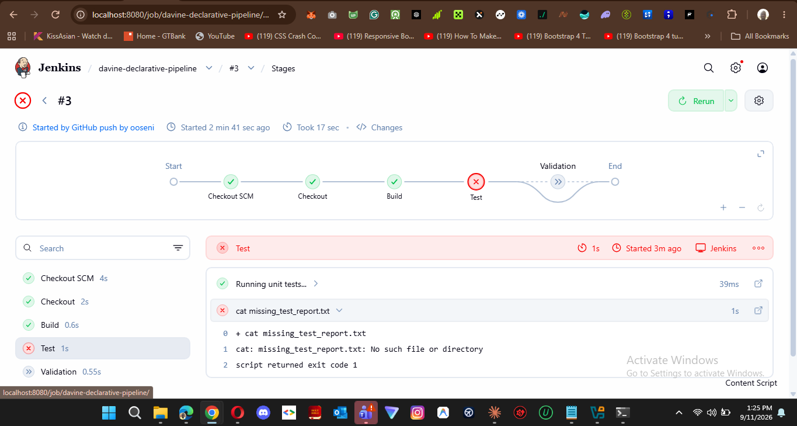
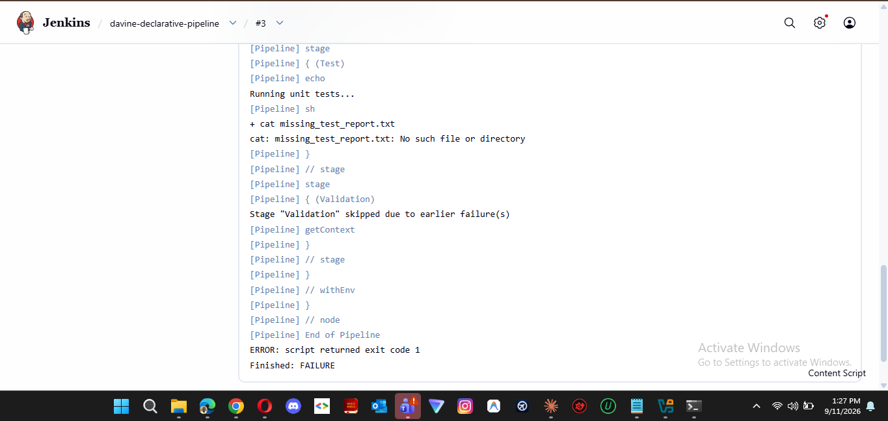
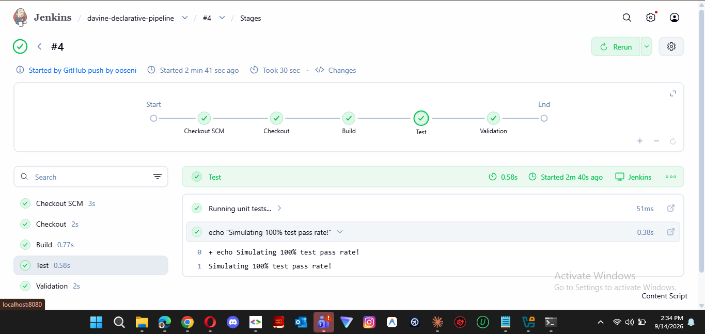

# Jenkins CI/CD Pipeline Implementation

## Overview
This repository contains the infrastructure code and documentation for a fully automated Continuous Integration (CI) pipeline built with Jenkins. The project demonstrates the evolution from manual, UI-configured jobs (Freestyle) to a modern, version-controlled **Pipeline-as-Code** (Declarative Pipeline) architecture.

Developed as part of the DevOps Engineering program at Davine Technology, this project emphasizes secure authentication, automated webhook triggers, and active failure recovery.

## Technology Stack
*   **CI/CD Server:** Jenkins (Native Linux Installation)
*   **Environment:** Ubuntu Linux (Vagrant VM / 2GB RAM)
*   **Version Control & SCM:** GitHub & Git
*   **Networking / Tunneling:** Ngrok (Secure Localhost Expose)
*   **Pipeline Language:** Groovy (Declarative Syntax)

---

## Pipeline Architecture
The deployment pipeline is defined in the `Jenkinsfile` and consists of four primary stages. The workflow is automatically triggered via GitHub Webhooks upon every push to the `main` branch.

1.  **Checkout:** Securely authenticates with GitHub using injected Personal Access Tokens (PAT) and clones the latest source code.
2.  **Build:** Initializes the build environment and executes compilation/build scripts.
3.  **Test:** Executes unit tests to ensure code integrity. *(Monitored for non-zero exit codes).*
4.  **Validation:** Performs final security and code quality checks before deployment readiness.

---

## Key Features & Configurations

### 1. Secure Credential Management
Hardcoded credentials are a major security vulnerability. This project utilizes Jenkins' **Global Credentials Store** to inject a GitHub Personal Access Token (PAT) securely at runtime, granting the pipeline scoped access to pull code without exposing secrets.

### 2. Automated Webhook Triggers
To bridge the gap between GitHub (public internet) and the local Jenkins server (Vagrant VM), an **Ngrok** secure tunnel was deployed directly on the VM (listening on IPv4 `127.0.0.1:8080`). GitHub is configured to send `application/json` payloads to the Ngrok URL endpoint (`/github-webhook/`), achieving zero-touch, automated pipeline execution.

### 3. Pipeline-as-Code (Declarative)
Unlike Freestyle jobs which are hidden in the Jenkins UI, the entire CI workflow is codified in the `Jenkinsfile`. This ensures the pipeline is versionable, reproducible, and lives alongside the application code.

---

## Troubleshooting & Root Cause Analysis 

As part of validating pipeline resilience, a deliberate failure was introduced to observe Jenkins' error-handling capabilities.

*   **Sabotage Method:** Introduced a faulty shell command (`cat missing_test_report.txt`) inside the **Test** stage.
*   **Observed Behavior:** The pipeline triggered automatically, passed Checkout and Build, but halted at the Test stage. The Validation stage was skipped to prevent the progression of broken code.

*   **Root Cause Analysis:** The Linux shell returned `exit code 1` due to a missing file. Jenkins strictly interprets any non-zero exit code as a critical failure and aborts the run, acting as a safeguard for the deployment environment.
*   **Pipeline Recovery:** The pipeline was successfully restored by reverting the faulty bash command in the `Jenkinsfile`, committing the fix to `main`, and observing the automated, successful 4-stage recovery build.

---
**Author:** Oseni Sakariyau Oluwadamilare (Dami)  
**Role:** DevOps Engineering Intern @ Davine Technology
